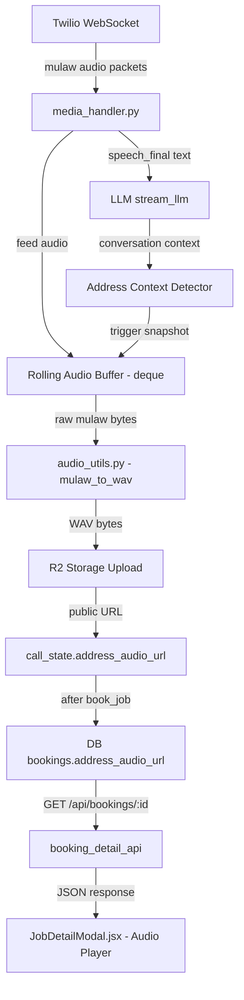
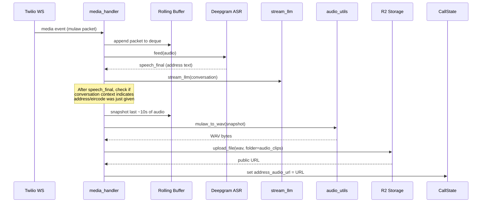
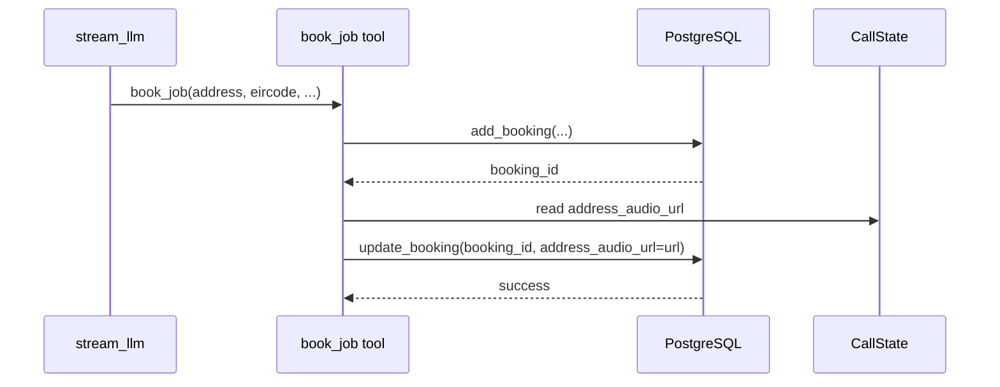
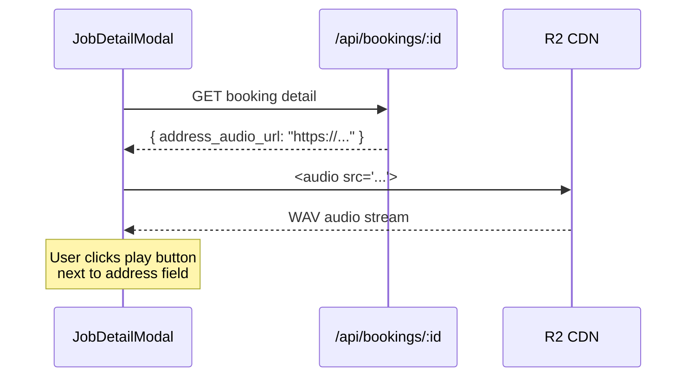

# Design Document: Address Audio Capture

## Overview

This feature captures the caller's voice when they speak their address or eircode during a booking call, stores the audio clip as a WAV file in R2 storage, and makes it playable in the job detail UI. The goal is to let the business owner replay exactly what the caller said for their address, reducing transcription errors for Irish addresses and eircodes.

The approach uses a rolling buffer of raw mulaw audio packets already flowing through `media_handler.py`. When the system detects (via conversation context) that the caller has just provided their address or eircode, it snapshots the buffer, converts mulaw to WAV, uploads to R2, and attaches the URL to the booking record. The frontend then renders a standard HTML5 audio player next to the address field.

## Architecture



## Sequence Diagrams

### Audio Capture Flow



### Booking Persistence Flow



### Frontend Playback Flow



## Components and Interfaces

### Component 1: Rolling Audio Buffer (media_handler.py)

**Purpose**: Maintains a sliding window of the last ~10 seconds of raw caller audio so it can be snapshotted when address context is detected.

**Interface**:
```python
# Added to media_handler.py local state
from collections import deque

AUDIO_BUFFER_SECONDS = 10
MULAW_SAMPLE_RATE = 8000  # 8kHz mulaw from Twilio
MULAW_BYTES_PER_PACKET = 160  # 20ms packets
MAX_BUFFER_PACKETS = (AUDIO_BUFFER_SECONDS * MULAW_SAMPLE_RATE) // MULAW_BYTES_PER_PACKET  # ~500 packets

audio_buffer: deque = deque(maxlen=MAX_BUFFER_PACKETS)
```

**Responsibilities**:
- Append every incoming mulaw packet from Twilio media events
- Auto-evict oldest packets when buffer exceeds ~10 seconds
- Provide snapshot as contiguous bytes on demand

### Component 2: Address Context Detector (media_handler.py)

**Purpose**: Determines whether the caller's most recent speech contained address or eircode information by examining conversation history and call state.

**Interface**:
```python
def is_address_speech(conversation: list, call_state: CallState, text: str) -> bool:
    """
    Check if the caller just provided their address or eircode.
    
    Uses heuristics:
    1. call_state.active_booking is True (we're in a booking flow)
    2. The last assistant message asked for address/eircode
    3. The speech text looks like an address or eircode pattern
    """
```

**Responsibilities**:
- Check conversation context for address-gathering phase
- Match eircode patterns (e.g., D02 WR97, A65 F4E2)
- Detect address-like content in speech text
- Return True only when confident this is address speech

### Component 3: Mulaw-to-WAV Converter (audio_utils.py)

**Purpose**: Converts raw mulaw 8kHz audio bytes into a browser-playable WAV file.

**Interface**:
```python
def mulaw_to_wav(mulaw_data: bytes, sample_rate: int = 8000) -> bytes:
    """
    Convert raw mulaw audio bytes to WAV format.
    
    Args:
        mulaw_data: Raw mulaw-encoded audio bytes
        sample_rate: Sample rate (default 8kHz for Twilio)
    
    Returns:
        Complete WAV file as bytes (PCM 16-bit mono)
    """
```

**Responsibilities**:
- Decode mulaw bytes to 16-bit PCM samples using existing `MU_LAW_DECODE_TABLE`
- Write proper WAV header (RIFF, fmt chunk, data chunk)
- Return complete WAV file bytes ready for upload

### Component 4: CallState Extensions (call_state.py)

**Purpose**: Store address audio URL and buffer reference on the per-call state.

**Interface**:
```python
# New fields on CallState dataclass
address_audio_url: Optional[str] = None
address_audio_captured: bool = False
```

**Responsibilities**:
- Hold the R2 URL after upload completes
- Track whether audio has already been captured (avoid duplicate captures)
- Reset with other booking fields

### Component 5: Database Schema Extension

**Purpose**: Persist the address audio URL with the booking record.

**Interface**:
```sql
ALTER TABLE bookings ADD COLUMN address_audio_url TEXT;
```

**Responsibilities**:
- Store the R2 public URL for the audio clip
- Allow NULL (most bookings won't have audio)
- Returned in booking queries

### Component 6: Audio Player UI (JobDetailModal.jsx)

**Purpose**: Render an HTML5 audio player next to the address field when an audio clip URL exists.

**Interface**:
```jsx
{job.address_audio_url && (
  <div className="address-audio-player">
    <button onClick={togglePlay} className="btn-audio-play">
      <i className={`fas ${isPlaying ? 'fa-pause' : 'fa-play'}`} />
    </button>
    <audio ref={audioRef} src={job.address_audio_url} preload="none" />
    <span className="audio-label">Listen to address</span>
  </div>
)}
```

**Responsibilities**:
- Show play/pause button inline with address text
- Use HTML5 `<audio>` element for browser-native playback
- Only render when `address_audio_url` is present
- Preload "none" to avoid unnecessary network requests

## Data Models

### Booking Record (extended)

```python
# Existing fields plus:
{
    "id": int,
    "address": str,
    "eircode": str,
    "address_audio_url": str | None,  # NEW - R2 public URL to WAV file
    # ... other existing fields
}
```

**Validation Rules**:
- `address_audio_url` must be a valid HTTPS URL or None
- URL must point to the configured R2 public domain
- WAV file should be under 1MB (10 seconds of 8kHz mono PCM ≈ 160KB)


## Key Functions with Formal Specifications

### Function 1: `mulaw_to_wav(mulaw_data, sample_rate)`

```python
def mulaw_to_wav(mulaw_data: bytes, sample_rate: int = 8000) -> bytes:
    """Convert raw mulaw audio to WAV format for browser playback."""
```

**Preconditions:**
- `mulaw_data` is non-empty bytes
- `sample_rate` is a positive integer (default 8000 for Twilio)
- Each byte in `mulaw_data` is a valid mulaw-encoded sample (0-255)

**Postconditions:**
- Returns valid WAV file bytes starting with `RIFF` header
- WAV format: PCM 16-bit signed, mono, at given sample_rate
- Output length = 44 (WAV header) + len(mulaw_data) * 2 (16-bit samples)
- No mutation of input data

**Loop Invariants:**
- For decoding loop: all previously decoded samples are valid 16-bit signed integers in [-32768, 32767]

### Function 2: `is_address_speech(conversation, call_state, text)`

```python
def is_address_speech(conversation: list, call_state: CallState, text: str) -> bool:
    """Detect if caller just provided address/eircode based on context."""
```

**Preconditions:**
- `conversation` is a non-empty list of message dicts with 'role' and 'content' keys
- `call_state` is a valid CallState instance
- `text` is a non-empty stripped string (the caller's speech)

**Postconditions:**
- Returns `True` if and only if:
  - `call_state.active_booking` is True AND
  - (the last assistant message asked for address/eircode OR text matches eircode pattern)
- Returns `False` if `call_state.address_audio_captured` is True (already captured)
- No side effects on any input

**Loop Invariants:** N/A

### Function 3: `snapshot_audio_buffer(audio_buffer)`

```python
def snapshot_audio_buffer(audio_buffer: deque) -> bytes:
    """Take a snapshot of the rolling audio buffer as contiguous bytes."""
```

**Preconditions:**
- `audio_buffer` is a deque of bytes objects (mulaw packets)
- Buffer is not empty

**Postconditions:**
- Returns concatenation of all packets in buffer as a single bytes object
- Original buffer is not modified
- Returned bytes length equals sum of all packet lengths in buffer

**Loop Invariants:**
- Concatenation preserves packet ordering (oldest first)

### Function 4: `upload_address_audio(wav_data, call_sid, company_id)`

```python
async def upload_address_audio(wav_data: bytes, call_sid: str, company_id: int) -> Optional[str]:
    """Upload WAV audio clip to R2 and return public URL."""
```

**Preconditions:**
- `wav_data` is valid WAV file bytes (starts with b'RIFF')
- `call_sid` is a non-empty string (Twilio call identifier)
- `company_id` is a positive integer

**Postconditions:**
- On success: returns HTTPS URL string pointing to uploaded WAV file
- On failure: returns None (R2 not configured or upload error)
- File stored at path `company_{company_id}/address_audio/{call_sid}.wav`
- Content-Type set to `audio/wav`

**Loop Invariants:** N/A


## Algorithmic Pseudocode

### Rolling Buffer & Capture Algorithm (media_handler.py)

```python
# --- Initialization (inside media_handler, after call_state creation) ---
from collections import deque

AUDIO_BUFFER_MAX_PACKETS = 500  # ~10 seconds at 8kHz/160-byte packets
audio_buffer = deque(maxlen=AUDIO_BUFFER_MAX_PACKETS)

# --- In the "media" event handler, after feeding ASR ---
# ASSERT: audio is base64-decoded mulaw bytes from Twilio
audio_buffer.append(audio)

# --- After speech_final is detected and text is committed ---
# ASSERT: text is non-empty, last_committed is updated
if (not call_state.address_audio_captured 
    and is_address_speech(conversation, call_state, text)):
    
    # Snapshot buffer
    raw_audio = b''.join(audio_buffer)
    
    # Convert to WAV (runs in thread to avoid blocking event loop)
    wav_data = await asyncio.to_thread(mulaw_to_wav, raw_audio)
    
    # Upload to R2
    url = await upload_address_audio(wav_data, call_sid, company_id)
    
    if url:
        call_state.address_audio_url = url
        call_state.address_audio_captured = True
        print(f"🎙️ Address audio captured: {url}")
```

### Address Context Detection Algorithm

```python
import re

EIRCODE_PATTERN = re.compile(
    r'\b[A-Z]\d{2}\s?[A-Z0-9]{4}\b',
    re.IGNORECASE
)

ADDRESS_ASK_KEYWORDS = [
    'address', 'eircode', 'eir code', 'location', 'where'
]

def is_address_speech(conversation: list, call_state: CallState, text: str) -> bool:
    # Guard: only during active booking, not already captured
    if not call_state.active_booking:
        return False
    if call_state.address_audio_captured:
        return False
    
    # Check 1: Does the text contain an eircode pattern?
    if EIRCODE_PATTERN.search(text):
        return True
    
    # Check 2: Did the last assistant message ask for address/eircode?
    last_assistant_msg = None
    for msg in reversed(conversation):
        if msg.get('role') == 'assistant':
            last_assistant_msg = msg.get('content', '').lower()
            break
    
    if last_assistant_msg:
        asked_for_address = any(kw in last_assistant_msg for kw in ADDRESS_ASK_KEYWORDS)
        if asked_for_address:
            return True
    
    return False
```

### Mulaw-to-WAV Conversion Algorithm

```python
import struct

def mulaw_to_wav(mulaw_data: bytes, sample_rate: int = 8000) -> bytes:
    # ASSERT: mulaw_data is non-empty
    num_samples = len(mulaw_data)
    
    # Decode mulaw to 16-bit PCM
    pcm_samples = bytearray(num_samples * 2)
    for i in range(num_samples):
        # INVARIANT: all samples[0..i-1] are valid 16-bit signed
        sample = MU_LAW_DECODE_TABLE[mulaw_data[i]]
        struct.pack_into('<h', pcm_samples, i * 2, sample)
    
    # Build WAV header (44 bytes)
    data_size = len(pcm_samples)
    file_size = 36 + data_size
    
    header = struct.pack(
        '<4sI4s4sIHHIIHH4sI',
        b'RIFF', file_size, b'WAVE',
        b'fmt ', 16,           # fmt chunk size
        1,                     # PCM format
        1,                     # mono
        sample_rate,           # sample rate
        sample_rate * 2,       # byte rate (16-bit mono)
        2,                     # block align
        16,                    # bits per sample
        b'data', data_size     # data chunk
    )
    
    # ASSERT: len(header) == 44
    return bytes(header) + bytes(pcm_samples)
```

## Example Usage

### Backend: Capturing and Uploading

```python
# In media_handler.py, after speech_final detection:
if is_address_speech(conversation, call_state, text):
    raw = b''.join(audio_buffer)
    wav = await asyncio.to_thread(mulaw_to_wav, raw)
    url = await upload_address_audio(wav, call_sid, company_id)
    if url:
        call_state.address_audio_url = url
        call_state.address_audio_captured = True

# In book_job tool (inside llm_stream.py), after booking is created:
if call_state.address_audio_url:
    db.update_booking(booking_id, address_audio_url=call_state.address_audio_url)
```

### Backend: API Response

```python
# In booking_detail_api, add to response_booking dict:
response_booking = {
    # ... existing fields ...
    'address_audio_url': booking.get('address_audio_url'),
}
```

### Frontend: Audio Player

```jsx
// In JobDetailModal.jsx, inside the address info-row:
{(job.job_address || job.address) && (
  <div className="info-row full">
    <div className="info-cell">
      <span className="info-label">Address</span>
      <span className="info-value">
        {job.job_address || job.address} {job.eircode && `(${job.eircode})`}
      </span>
      {job.address_audio_url && (
        <div className="address-audio-player">
          <audio controls preload="none" src={job.address_audio_url}>
            Your browser does not support audio playback.
          </audio>
        </div>
      )}
    </div>
  </div>
)}
```

## Correctness Properties

1. **Buffer Boundedness**: ∀ time t, `len(audio_buffer) ≤ AUDIO_BUFFER_MAX_PACKETS`. The deque maxlen guarantees this.

2. **Single Capture**: ∀ call c, address audio is captured at most once. Once `call_state.address_audio_captured = True`, `is_address_speech()` returns False.

3. **WAV Validity**: ∀ mulaw input m where `len(m) > 0`, `mulaw_to_wav(m)` produces bytes starting with `b'RIFF'` and of length `44 + len(m) * 2`.

4. **No Data Loss on Buffer Snapshot**: `b''.join(audio_buffer)` preserves all packets in chronological order. The deque is not cleared by snapshot.

5. **Graceful Degradation**: If R2 is not configured or upload fails, `upload_address_audio` returns None and the booking proceeds without audio. The feature is entirely optional.

6. **Context Accuracy**: Address audio is only captured when `active_booking` is True AND either an eircode pattern is detected in speech OR the last assistant message asked for address/eircode. This minimizes false positives.

7. **Audio URL Persistence**: If `call_state.address_audio_url` is set when `book_job` runs, the URL is persisted to the `bookings` table. The URL is returned in the booking detail API response.

## Error Handling

### Error Scenario 1: R2 Not Configured

**Condition**: R2 environment variables are missing
**Response**: `upload_address_audio` returns None, logs a warning
**Recovery**: Booking proceeds normally without audio URL. Feature is silently disabled.

### Error Scenario 2: Mulaw Conversion Failure

**Condition**: Empty or corrupted audio buffer
**Response**: `mulaw_to_wav` raises ValueError if input is empty; caught in media_handler
**Recovery**: Log error, skip audio capture, continue call normally

### Error Scenario 3: Upload Timeout/Failure

**Condition**: R2 upload fails (network error, permission issue)
**Response**: `upload_address_audio` catches ClientError, returns None
**Recovery**: Log error, booking proceeds without audio. No retry needed (audio is ephemeral).

### Error Scenario 4: Audio URL Missing in Frontend

**Condition**: `address_audio_url` is null in booking response
**Response**: Audio player component is not rendered (conditional rendering)
**Recovery**: N/A — this is the normal case for bookings without captured audio

### Error Scenario 5: Call Ends Before Capture Completes

**Condition**: WebSocket closes while upload is in progress
**Response**: Upload task may complete or be cancelled
**Recovery**: If upload completes, URL is orphaned in R2 (acceptable). If cancelled, no URL is stored.

## Testing Strategy

### Unit Testing Approach

- `mulaw_to_wav`: Test with known mulaw bytes, verify WAV header structure and PCM output
- `is_address_speech`: Test with various conversation histories and call states
- `snapshot_audio_buffer`: Test with empty, partial, and full deque

### Property-Based Testing Approach

**Property Test Library**: hypothesis (Python)

- For `mulaw_to_wav`: ∀ random bytes b where len(b) > 0, output starts with b'RIFF' and has correct length
- For `is_address_speech`: ∀ text containing eircode pattern with active_booking=True, returns True
- For rolling buffer: ∀ sequence of appends, buffer never exceeds maxlen

### Integration Testing Approach

- End-to-end: Simulate Twilio media packets → verify WAV file uploaded to R2
- API: Create booking with address_audio_url → verify it's returned in GET response
- Frontend: Mock booking with address_audio_url → verify audio element renders

## Security Considerations

- Audio files are stored in company-scoped R2 folders (`company_{id}/address_audio/`) matching existing security patterns
- Audio URLs are only returned to authenticated users who own the company (existing `login_required` + company_id filtering)
- WAV files contain only the caller's voice for the address portion (~10 seconds max), minimizing sensitive data exposure
- R2 public URLs use the same CDN/domain as existing file uploads

## Dependencies

- `collections.deque` — Standard library, for rolling buffer
- `struct` — Standard library, for WAV header construction
- `src/services/storage_r2.py` — Existing R2 upload infrastructure
- `src/utils/audio_utils.py` — Existing mulaw decode table, extended with `mulaw_to_wav`
- `src/services/call_state.py` — Existing per-call state, extended with audio fields
- `src/services/db_postgres_wrapper.py` — Existing DB wrapper, extended with `address_audio_url` field
